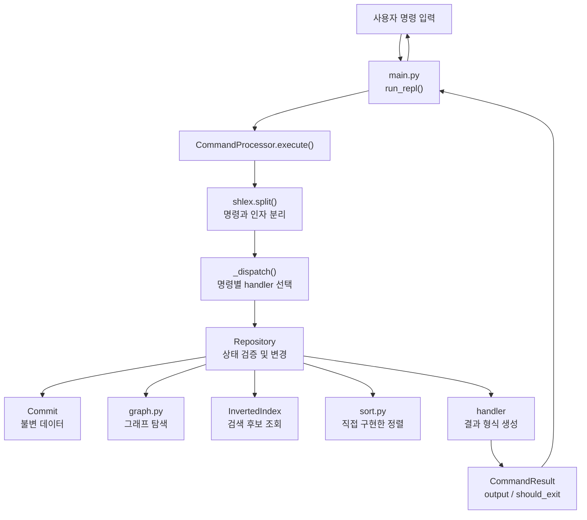
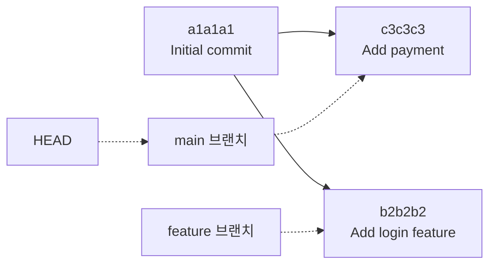
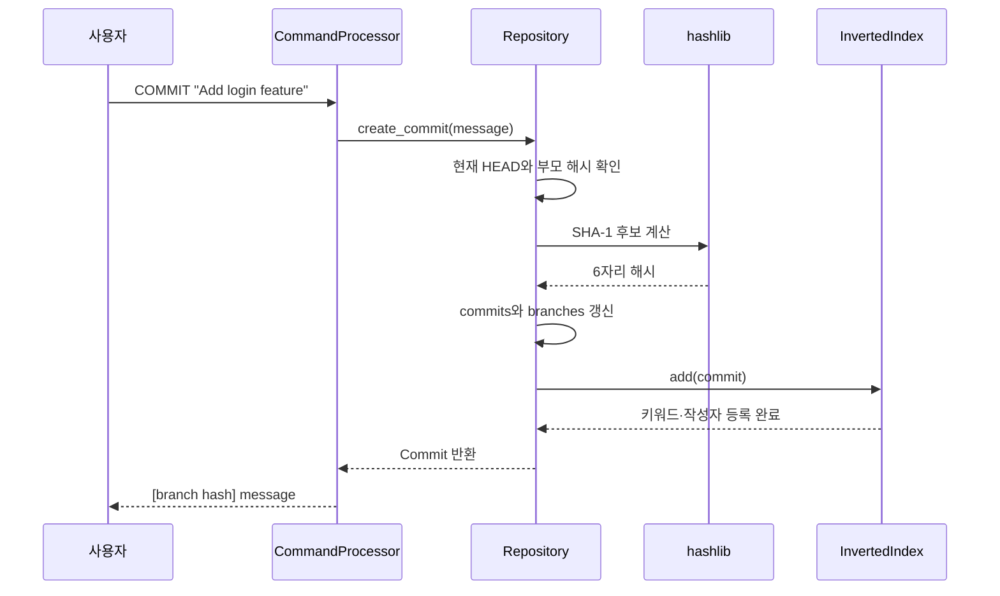

# Mini Git 초보자용 코드 분석 가이드

이 문서는 Python을 처음 배우는 사람도 Mini Git의 코드를 **어떤 순서로 읽고,
무엇을 확인해야 하는지** 알 수 있도록 만든 학습 가이드입니다. 명령 사용법만
빠르게 보고 싶다면 먼저 [README](../README.md)를 읽어 주세요.

이 문서의 목표는 코드를 외우는 것이 아닙니다. 다음 질문에 스스로 답할 수 있게
되는 것이 목표입니다.

- 사용자가 입력한 한 줄은 어떤 객체와 함수를 지나 결과가 되는가?
- 명령을 실행하면 저장소의 어떤 상태가 바뀌고, 어떤 상태는 그대로인가?
- 왜 `dict`, `set`, `tuple` 같은 자료형을 각각 다르게 사용했는가?
- LOG, PATH, SEARCH에는 어떤 알고리즘이 사용되는가?
- 테스트는 구현이 맞다는 사실을 어떻게 증명하는가?

직접 실행하며 배우려면 [실습형 학습 노트](STUDY_WORKBOOK.md)의 단계별 예제부터
진행하세요. 이 가이드는 문법과 함수의 상세 설명을 찾아보는 용도로 함께 사용합니다.

## 1. 가장 먼저 알아둘 것

### 이 프로그램이 하는 일

Mini Git은 실제 파일 내용을 저장하지 않고 다음 **커밋 메타데이터**만 메모리에
보관합니다.

- 6자리 커밋 해시
- 커밋 메시지
- 작성자
- 생성 시각
- 부모 커밋 해시

브랜치는 별도의 커밋 복사본이 아닙니다. 특정 커밋 해시를 가리키는 이름표에
가깝습니다. HEAD 역시 커밋 객체를 직접 저장하지 않고 현재 사용 중인 브랜치
이름을 기억합니다.

### 분석할 때 구분해야 할 세 가지

| 구분 | 이 프로젝트에서의 예 | 확인할 질문 |
| --- | --- | --- |
| 데이터 | `Commit`, `commits`, `branches` | 무엇을 어떤 자료형으로 저장하는가? |
| 제어 흐름 | `run_repl()` → `execute()` → `_dispatch()` | 입력이 어떤 순서로 이동하는가? |
| 알고리즘 | BFS, 위상 정렬, 역색인, 병합 정렬 | 왜 이 방법을 선택했고 비용은 얼마인가? |

코드를 읽다가 막히면 현재 보고 있는 부분이 이 세 종류 중 어디에 해당하는지
먼저 분류해 보세요. 한꺼번에 모든 세부 사항을 이해하려는 것보다 훨씬 쉽습니다.

## 2. 권장 코드 읽기 순서

프로그램이 실행되는 순서대로 `main.py`부터 읽어도 되지만, 초보자에게는 아래처럼
**작은 데이터에서 큰 흐름으로** 올라가는 순서가 더 이해하기 쉽습니다.

1. [`minigit/models.py`](../minigit/models.py)
   - 커밋 한 개가 어떤 값으로 구성되는지 확인합니다.
   - `@dataclass`, `frozen`, `slots`, `tuple`의 의미를 살펴봅니다.
2. [`minigit/algorithms/sort.py`](../minigit/algorithms/sort.py)
   - 다른 상태에 의존하지 않는 순수한 정렬 함수부터 읽습니다.
   - `key` 함수, 재귀, 안정 정렬을 확인합니다.
3. [`minigit/algorithms/index.py`](../minigit/algorithms/index.py)
   - 커밋이 검색용 표에 어떻게 등록되는지 확인합니다.
4. [`minigit/algorithms/graph.py`](../minigit/algorithms/graph.py)
   - 여러 커밋이 연결된 그래프를 어떻게 탐색하는지 확인합니다.
5. [`minigit/repository.py`](../minigit/repository.py)
   - 앞에서 본 데이터와 알고리즘이 실제 저장소 기능으로 합쳐지는 지점입니다.
6. [`minigit/parser.py`](../minigit/parser.py)
   - 문자열 명령을 검사하고 저장소 메서드로 연결하는 과정을 읽습니다.
7. [`main.py`](../main.py)
   - 입력과 출력을 반복하는 가장 바깥쪽 REPL을 확인합니다.
8. [`tests/`](../tests)
   - 앞에서 이해한 동작이 테스트에서 어떻게 증명되는지 확인합니다.

각 파일을 처음 읽을 때는 모든 줄을 파고들지 말고 다음 세 가지만 표시해 보세요.

- 외부에서 호출하는 공개 클래스와 함수
- 입력값과 반환값
- 객체의 상태를 변경하는 코드

## 3. 코드를 읽기 위한 Python 기초

여기서는 Python 전체 문법이 아니라 이 프로젝트에 실제로 등장하는 문법만
정리합니다.

### 3.1 모듈, 패키지, import

Python 파일 하나를 **모듈**이라고 합니다. `minigit/`처럼 `__init__.py`가 있는
폴더는 여러 모듈을 묶은 **패키지**입니다.

```python
from minigit.models import Commit
```

이 코드는 `minigit/models.py`에서 `Commit`이라는 이름을 가져옵니다. 따라서
파일 사이 관계를 분석할 때는 맨 위의 import부터 보면 어떤 모듈이 누구에게
의존하는지 빠르게 알 수 있습니다.

`main.py`의 마지막 부분은 파일을 직접 실행했을 때만 `main()`을 호출합니다.

```python
if __name__ == "__main__":
    main()
```

테스트가 `main.py`를 import할 때 REPL이 자동으로 시작되지 않는 이유도 이 조건
덕분입니다.

### 3.2 dataclass와 불변 객체

[`Commit`](../minigit/models.py)은 `@dataclass`로 정의되어 있습니다.

```python
@dataclass(frozen=True, slots=True)
class Commit:
    hash: str
    message: str
    author: str
    timestamp: str
    parents: tuple[str, ...]
```

- `@dataclass`는 필드를 바탕으로 생성자와 비교 기능 등을 자동으로 만듭니다.
- `frozen=True`는 생성 후 `commit.message = ...`처럼 필드를 바꾸지 못하게 합니다.
- `slots=True`는 선언한 필드 중심으로 객체를 가볍게 관리하고, 잘못된 새 속성을
  임의로 추가하지 못하게 합니다.
- `parents`가 `list`가 아니라 `tuple`인 이유는 tuple의 원소를 생성 후 변경할 수
  없어 커밋의 불변성을 더 잘 지킬 수 있기 때문입니다.

실제 Git에서도 기존 커밋을 수정하는 대신 새로운 커밋을 만듭니다. 이 프로젝트의
불변 객체는 그 성질을 단순하게 표현합니다.

### 3.3 list, tuple, dict, set

| 자료형 | 특징 | 실제 사용 위치 | 선택 이유 |
| --- | --- | --- | --- |
| `list` | 순서가 있고 변경 가능 | 로그 결과, 최종 PATH, 직접 구현한 힙 | 출력 순서와 원소 추가가 필요함 |
| `tuple` | 순서가 있고 변경 불가 | `Commit.parents`, 정렬용 복합 키 | 커밋 불변성, 여러 비교 기준 묶기 |
| `dict` | 키로 값을 빠르게 찾음 | `commits`, `branches`, 역색인 | 해시나 이름으로 평균 O(1) 조회 |
| `set` | 중복 없이 값을 보관 | 방문 커밋, 검색 결과 해시 | 중복 제거와 평균 O(1) 포함 검사 |

예를 들어 `commits["a1b2c3"]`은 전체 커밋을 차례로 검사하지 않고 해당 해시의
커밋을 바로 찾습니다. `visited`가 set인 이유도 이미 방문한 해시인지 빠르게
확인하기 위해서입니다.

### 3.4 타입 힌트

타입 힌트는 실행을 강제하는 규칙이라기보다 사람과 도구가 값의 모양을 이해하도록
돕는 표기입니다.

| 표기 | 뜻 | 예시 |
| --- | --- | --- |
| `str | None` | 문자열 또는 아직 값이 없음 | `head_branch` |
| `dict[str, Commit]` | 문자열 키와 Commit 값의 사전 | `commits` |
| `tuple[str, ...]` | 문자열이 0개 이상 있는 tuple | `parents` |
| `list[str] | None` | 문자열 목록 또는 경로 없음 | `find_shortest_path()` |
| `Callable[[], datetime]` | 인자 없이 호출해 datetime을 반환하는 함수 | 테스트용 `clock` |
| `Sequence[T]` | list나 tuple처럼 순서가 있는 입력 | 정렬 함수 입력 |
| `Mapping[str, Commit]` | 읽기 관점의 키-값 구조 | 그래프 함수 입력 |

`sort.py`의 `T = TypeVar("T")`는 정렬 대상이 정수나 Commit 등 어떤 타입이든 될
수 있다는 뜻입니다. 입력 원소 타입과 결과 원소 타입이 같다는 관계도 표현합니다.

각 파일의 다음 import는 타입 힌트를 현재 파일에서 즉시 계산하지 않고 나중에
해석하게 해, 자기 자신을 참조하는 타입이나 최신 표기를 다루기 편하게 합니다.

```python
from __future__ import annotations
```

### 3.5 인스턴스 메서드, property, staticmethod

- `self`가 첫 인자인 메서드는 특정 객체의 상태를 읽거나 바꾸는 **인스턴스
  메서드**입니다. `repository.create_commit()`이 대표적입니다.
- `@property`를 붙인 `head_hash`는 메서드지만 `repository.head_hash`처럼 값으로
  읽습니다. 계산 과정이나 검증을 감춘 채 속성처럼 사용할 수 있습니다.
- `@staticmethod`를 붙인 `tokenize()`와 `_has_one_nonempty_arg()`는 객체 상태인
  `self`가 필요 없는 보조 함수입니다. 관련 클래스 안에 두되 독립적으로 동작합니다.

이름이 `_dispatch`처럼 밑줄로 시작하면 외부 공개 API보다는 클래스 내부 구현에
사용한다는 관례입니다. Python이 접근을 완전히 막는 것은 아닙니다.

### 3.6 예외, try/except, assert

저장소에서 사용자가 요청한 작업을 수행할 수 없으면 `RepositoryError`를
발생시킵니다.

```python
raise RepositoryError(f"Unknown branch: {branch_name}")
```

`CommandProcessor.execute()`는 이 예외를 잡아 프로그램을 종료하지 않고 오류
문자열로 바꿉니다.

```python
try:
    return self._dispatch(command, args)
except RepositoryError as error:
    return CommandResult(str(error))
```

반면 `assert self.head_branch is not None`은 사용자의 잘못된 입력을 처리하기 위한
코드가 아닙니다. 앞에서 이미 초기화 검사를 통과했으므로 반드시 참이어야 하는
**내부 불변 조건**을 개발자와 타입 검사 도구에 알립니다.

### 3.7 lambda와 key 함수

정렬 함수는 어떤 기준으로 비교할지 `key` 함수로 전달받습니다.

```python
key=lambda commit: (commit.timestamp, commit.hash)
```

이 lambda는 Commit 한 개를 받아 `(timestamp, hash)` tuple을 반환합니다. Python은
tuple의 첫 값부터 비교하고, 같으면 다음 값을 비교합니다. 그래서 생성 시각이
같아도 해시를 이용해 항상 일정한 순서를 만들 수 있습니다.

정렬 알고리즘과 비교 기준을 분리했기 때문에 같은 `merge_sort()`를 날짜순,
작성자순, 브랜치 이름순에 모두 재사용할 수 있습니다.

### 3.8 재귀

재귀는 함수가 자신을 다시 호출하는 방식입니다. Merge Sort와 Quick Sort는 큰
범위를 더 작은 범위로 나누기 위해 재귀를 사용합니다.

재귀 함수를 볼 때는 다음 두 부분을 반드시 따로 찾으세요.

1. **종료 조건**: 더 나누지 않고 반환하는 조건
2. **문제 축소**: 다음 호출에서는 입력 범위가 실제로 작아지는지

`merge_sort()`의 `len(values) <= 1`, `_quick_sort_range()`의 `low >= high`가
각각 종료 조건입니다.

### 3.9 의존성 주입

의존성 주입은 객체가 필요한 도구를 내부에서 고정하지 않고 외부에서 받을 수
있게 하는 설계입니다.

```python
Repository(clock=SequenceClock(...))
CommandProcessor(repository=repository)
run_repl(processor=processor)
```

실제 실행에서는 현재 시각과 새 저장소를 기본으로 사용합니다. 테스트에서는
원하는 시각이나 미리 준비한 저장소를 넣어 결과를 예측 가능하게 만듭니다.

### 3.10 사용한 표준 라이브러리

| 모듈 | 역할 |
| --- | --- |
| `shlex` | 따옴표로 묶은 CLI 인자를 올바르게 분리 |
| `hashlib` | 커밋 메타데이터로 SHA-1 해시 계산 |
| `datetime` | 커밋 생성 시각 생성 및 형식 변환 |
| `unittest` | 단위 테스트와 통합 테스트 실행 |
| `subprocess` | 실제 `main.py` 프로세스의 입출력 테스트 |

외부 패키지나 그래프 라이브러리는 사용하지 않습니다.

## 4. 전체 구조 한눈에 보기

### 입력에서 출력까지



`main.py`는 알고리즘을 알지 못하고, `graph.py`는 CLI 문법을 알지 못합니다.
각 모듈이 한 종류의 책임에 집중하도록 분리되어 있습니다.

### 모듈별 책임과 핵심 심볼

| 모듈 | 핵심 심볼 | 책임 |
| --- | --- | --- |
| `models.py` | `Commit` | 커밋 한 개의 데이터 모양 정의 |
| `sort.py` | `merge_sort`, `quick_sort` | 비교 기준을 받아 정렬한 새 list 반환 |
| `index.py` | `InvertedIndex` | 키워드·작성자와 커밋 해시의 관계 관리 |
| `graph.py` | `topological_sort`, `find_shortest_path`, `find_ancestors` | DAG 로그, 최단 경로, 조상 탐색 |
| `repository.py` | `Repository`, `RepositoryError` | 커밋·브랜치·HEAD 상태와 기능 통합 |
| `parser.py` | `CommandProcessor`, `CommandResult` | CLI 문법 검증, 기능 호출, 출력 형식 생성 |
| `main.py` | `run_repl`, `main` | 입력과 출력을 반복하고 종료 처리 |
| `tests/` | `unittest.TestCase` 하위 클래스 | 정상·오류·경계 동작 검증 |

### 의존 방향

상위 모듈은 아래 모듈을 조합하지만, 아래 모듈은 상위 CLI를 알지 못합니다.

```text
main
└── parser
    └── repository
        ├── models
        └── algorithms
            ├── graph
            ├── index
            └── sort
```

이 방향을 기억하면 한 함수가 어디에서 호출되는지 찾기 쉽습니다. 예를 들어
`find_shortest_path()`의 사용처를 찾으려면 한 단계 위인 `repository.py`의
`get_path()`를 확인하면 됩니다.

## 5. 핵심 데이터와 상태

### 5.1 Commit 한 개

다음은 설명을 위한 가상의 Commit입니다.

```python
Commit(
    hash="b2b2b2",
    message="Add login feature",
    author="Alice",
    timestamp="2024-01-15 09:15:00",
    parents=("a1a1a1",),
)
```

`parents`에는 Commit 객체 전체가 아니라 부모의 **해시 문자열**만 들어갑니다.
실제 객체가 필요하면 `repository.commits[parent_hash]`로 조회합니다.

### 5.2 Repository가 보관하는 값

| 속성 | 타입 | 의미 | 변경되는 명령 |
| --- | --- | --- | --- |
| `commits` | `dict[str, Commit]` | 해시에서 커밋으로 가는 저장소 | `COMMIT` |
| `branches` | `dict[str, str | None]` | 브랜치에서 최신 커밋 해시로 가는 포인터 | `INIT`, `BRANCH`, `COMMIT` |
| `head_branch` | `str | None` | 현재 선택한 브랜치 이름 | `INIT`, `SWITCH` |
| `current_user` | `str | None` | 새 커밋 작성자 | `INIT` |
| `index` | `InvertedIndex` | 키워드·작성자 검색 표 | `COMMIT` |
| `_hash_nonce` | `int` | 해시 충돌을 피할 내부 순번 | `COMMIT` |

### 5.3 명령에 따른 상태 변화

아래 해시는 이해를 위한 고정 예시입니다. 실제 실행에서는 커밋 내용과 시각에
따라 다른 값이 생성됩니다.

| 실행 직후 | `head_branch` | `branches` | `commits` |
| --- | --- | --- | --- |
| `INIT Alice` | `main` | `{"main": None}` | `{}` |
| `COMMIT "Initial commit"` | `main` | `{"main": "a1a1a1"}` | `a1a1a1` 추가 |
| `BRANCH feature` | `main` | `{"main": "a1a1a1", "feature": "a1a1a1"}` | 변화 없음 |
| `SWITCH feature` | `feature` | 변화 없음 | 변화 없음 |
| `COMMIT "Add login feature"` | `feature` | `feature`가 `b2b2b2`를 가리킴 | 부모가 `a1a1a1`인 `b2b2b2` 추가 |
| `SWITCH main` 후 `COMMIT "Add payment"` | `main` | `main`이 `c3c3c3`을 가리킴 | 부모가 `a1a1a1`인 `c3c3c3` 추가 |

이 상태의 그래프는 다음과 같습니다. 화살표는 이해하기 쉽게 **부모에서 자식**
방향으로 그렸지만, Commit 객체에는 반대편인 자식의 `parents` 필드에 부모 해시가
저장됩니다.



이 그래프가 DAG인 이유는 새 커밋이 이미 존재하는 과거 커밋만 부모로 삼기
때문입니다. 미래 커밋을 부모로 가리키는 역방향 연결을 만들지 않으므로 순환이
생기지 않습니다.

### 5.4 같은 시점의 역색인

`COMMIT`을 실행할 때 `InvertedIndex.add()`도 함께 호출됩니다.

```python
keyword_index = {
    "initial": {"a1a1a1"},
    "commit": {"a1a1a1"},
    "add": {"b2b2b2", "c3c3c3"},
    "login": {"b2b2b2"},
    "feature": {"b2b2b2"},
    "payment": {"c3c3c3"},
}

author_index = {
    "alice": {"a1a1a1", "b2b2b2", "c3c3c3"},
}
```

set을 사용하므로 메시지에 `login`이 여러 번 등장해도 같은 해시는 한 번만
저장됩니다.

## 6. 한 명령이 실행되는 공통 흐름

모든 일반 명령은 다음 과정을 거칩니다.

1. `run_repl()`이 `input("mini-git> ")`으로 한 줄을 읽습니다.
2. `CommandProcessor.execute()`가 `shlex.split()`으로 명령과 인자를 나눕니다.
3. 명령 이름만 `lower()`로 바꿔 대소문자 차이를 없앱니다.
4. `_dispatch()`가 `_handle_commit()` 같은 명령별 handler를 선택합니다.
5. handler가 인자 개수와 옵션 문법을 검사합니다.
6. `Repository` 메서드가 저장소 상태를 검증하고 필요한 작업을 수행합니다.
7. handler가 반환값을 사용자가 읽을 문자열로 바꿉니다.
8. `CommandResult`가 문자열과 종료 여부를 REPL에 전달합니다.
9. REPL이 문자열을 출력하고 다음 입력을 기다립니다.

예를 들어 따옴표가 있는 입력은 다음처럼 분리됩니다.

```text
입력: COMMIT "Add login feature"
결과: ["COMMIT", "Add login feature"]
```

`str.split()`만 사용하면 메시지가 세 조각으로 나뉘지만, `shlex.split()`은
따옴표 안의 공백을 유지합니다. 닫히지 않은 따옴표는 `ValueError`가 되며
`execute()`가 이를 `Invalid args`로 바꿉니다.

## 7. 명령별 코드 추적

### 7.1 INIT

호출 경로는 다음과 같습니다.

```text
CommandProcessor._handle_init()
└── Repository.initialize()
```

1. handler가 사용자명이 비어 있지 않은 한 개의 인자인지 검사합니다.
2. `initialize()`는 이미 초기화된 저장소인지 확인합니다.
3. `current_user`에 사용자명을 저장합니다.
4. `head_branch`를 `main`으로 설정합니다.
5. 아직 커밋이 없으므로 `branches["main"]`에는 `None`을 저장합니다.

`INIT`은 Commit을 만들지 않고 검색 인덱스도 변경하지 않습니다.

### 7.2 COMMIT



`Repository.create_commit()`을 읽을 때는 다음 **갱신 순서**를 따라가세요.

1. 저장소 초기화 여부와 빈 메시지를 검사합니다.
2. 현재 브랜치가 가리키는 해시를 읽습니다.
3. 첫 커밋이면 `parents=()`, 그 외에는 `parents=(current_hash,)`로 만듭니다.
4. 현재 시각을 `YYYY-MM-DD HH:MM:SS` 문자열로 만듭니다.
5. `_make_unique_hash()`로 6자리 해시를 생성합니다.
6. 불변 `Commit` 객체를 만듭니다.
7. `commits[commit_hash]`에 객체를 저장합니다.
8. 현재 브랜치가 새 해시를 가리키도록 바꿉니다.
9. `index.add(commit)`으로 검색 표를 갱신합니다.

여기서는 커밋 저장, 브랜치 이동, 인덱스 갱신이 함께 일어나야 합니다. 셋 중
하나를 빠뜨리면 커밋은 만들어졌지만 로그나 검색 결과가 서로 맞지 않는 문제가
생깁니다.

### 7.3 BRANCH와 SWITCH

`BRANCH feature`는 새 커밋을 만들지 않습니다.

```python
branches["feature"] = current_hash
```

현재 브랜치와 새 브랜치가 처음에는 같은 커밋을 가리킵니다. 이후 `SWITCH
feature`를 실행하고 커밋하면 feature 포인터만 새 커밋으로 이동합니다.

`SWITCH` 역시 커밋이나 브랜치 포인터 값을 바꾸지 않고 `head_branch` 문자열만
바꿉니다. 명령 이름은 대소문자를 구분하지 않지만 브랜치 이름은 별도로
소문자화하지 않으므로 `feature`와 `Feature`는 서로 다른 이름입니다.

### 7.4 LOG

```text
LOG
└── Repository.get_log(None)
    └── topological_sort(commits)

LOG --sort-by=date
└── Repository.get_log("date")
    └── merge_sort(..., key=(timestamp, hash))

LOG --sort-by=author
└── Repository.get_log("author")
    └── merge_sort(..., key=(author.lower(), timestamp, hash))
```

옵션이 없는 LOG는 최신순 정렬이 아니라 **부모 우선 위상 순서**입니다. 옵션이
있으면 DAG 관계보다 사용자가 선택한 날짜 또는 작성자 비교 기준을 우선합니다.

handler는 `Repository.branches_by_commit()`으로 브랜치를 한 번 순회해 해시별
이름 목록을 만들고, `_format_log_commit(commit, branch_names)`에 전달합니다. 브랜치는 과거 커밋 전체에 표시되는 것이 아니라 현재 그 해시를 직접
가리킬 때만 표시됩니다.

### 7.5 PATH

```text
CommandProcessor._handle_path()
└── Repository.get_path()
    ├── get_commit(start_hash)
    ├── get_commit(end_hash)
    └── find_shortest_path()
        ├── build_undirected_graph()
        ├── _bfs_distances(graph, start_hash)
        ├── _bfs_distances(graph, end_hash)
        └── 거리 조건으로 사전순 최소 경로 복원
```

1. 시작과 끝 해시가 실제로 존재하는지 먼저 확인합니다.
2. 부모 연결을 양방향 인접 리스트로 변환합니다.
3. 시작점과 끝점에서 각각 BFS를 실행해 모든 도달 가능한 커밋의 거리를 구합니다.
4. 시작점에서 한 층 앞으로 가며 전체 최단 거리를 유지하는 이웃만 후보로 남깁니다.
5. 후보 중 해시가 가장 작은 커밋을 반복해서 선택해 사전순 최소 경로를 만듭니다.
6. 연결이 없으면 `None`을 반환하고 handler가 `No path`를 출력합니다.

PATH에서만 부모-자식 연결을 무방향으로 보는 이유는 두 커밋 사이를 찾을 때
조상 방향과 자손 방향 모두로 이동할 수 있어야 하기 때문입니다.

### 7.6 ANCESTORS

```text
CommandProcessor._handle_ancestors()
└── Repository.get_ancestors()
    ├── find_ancestors()
    └── topological_sort(ancestor_commits)
```

`find_ancestors()`는 요청한 커밋의 `parents`에서 시작해 스택으로 계속 부모를
찾습니다. set에 이미 들어 있는 해시는 다시 처리하지 않습니다. 요청한 커밋
자신은 결과에 포함하지 않습니다.

탐색 결과는 set이라 출력 순서가 없습니다. 따라서 `Repository.get_ancestors()`는
찾은 조상들만 작은 그래프로 만든 뒤 다시 위상 정렬해 결정적인 순서로 반환합니다.

### 7.7 SEARCH

```text
SEARCH "login feature"
└── Repository.search_keyword()
    ├── InvertedIndex.search_keywords()
    └── _commits_in_date_order()

SEARCH --author="Alice Kim"
└── Repository.search_author()
    ├── InvertedIndex.search_author()
    └── _commits_in_date_order()
```

메시지와 검색어는 `lower().split()`으로 정규화됩니다. 여러 단어 검색은 각 단어의
해시 set을 교집합하여 **모든 단어가 들어 있는 커밋**만 남깁니다.

```text
login  -> {a1a1a1, b2b2b2}
feature -> {b2b2b2, c3c3c3}
교집합  -> {b2b2b2}
```

작성자 검색은 부분 문자열 검색이 아니라 소문자로 정규화한 작성자 전체가 정확히
일치해야 합니다. 검색 결과 set은 날짜와 해시 기준 Merge Sort를 거친 뒤 출력됩니다.
`--author=<name>`은 작성자 옵션이며, 값 없이 정확히 `--author`만 입력하면 잘못된
옵션으로 처리됩니다. `--fix`처럼 그 밖의 `--` 접두사 문자열은 일반 키워드로
검색할 수 있습니다. `SEARCH -- "--author"`나 `SEARCH -- "--author=Bob"`처럼
옵션 종료 기호를 쓰면 예약된 옵션 모양의 단어도 메시지에서 검색합니다.
`shlex.split()`이 따옴표를 제거하므로 따옴표만으로는 이 구분을 할 수 없습니다.

## 8. 알고리즘을 코드와 연결해 이해하기

### 8.1 SHA-1 해시와 nonce

`_make_unique_hash()`는 다음 값을 구분 문자와 함께 이어 SHA-1을 계산합니다.

```text
message + author + timestamp + parents + nonce
```

SHA-1 전체는 40자리 16진수이지만 과제 명세에 맞춰 앞 6자리만 사용합니다. 6자리
공간은 `16⁶`개이므로 서로 다른 입력이 같은 앞 6자리를 가질 가능성이 있습니다.

이를 **해시 충돌**이라고 합니다. 현재 구현은 후보가 이미 `commits`에 있으면
`nonce`를 증가시켜 다시 계산합니다. 따라서 한 세션에서 같은 6자리 해시를 두
커밋에 배정하지 않습니다.

분석 포인트:

- `nonce`는 사용자가 보는 Commit 필드가 아니라 저장소 내부 상태입니다.
- 해시는 메시지만이 아니라 작성자, 시각, 부모 관계도 반영합니다.
- 충돌 검사는 `candidate not in self.commits`로 평균 O(1)에 수행됩니다.

### 8.2 Kahn 위상 정렬

`topological_sort()`의 핵심 변수는 다음과 같습니다.

| 변수 | 의미 |
| --- | --- |
| `indegree[hash]` | 아직 먼저 출력해야 하는 부모 수 |
| `children[parent]` | 해당 부모를 가리키는 직접 자식 set |
| `ready` | 부모가 모두 출력된 Commit을 담는 직접 구현한 최소 힙 |
| `result` | 최종 로그 순서 |

다음 그래프를 생각해 봅시다.

```text
A → B
A → C
```

처음 진입 차수는 `A=0, B=1, C=1`입니다. A를 출력하면 B와 C의 값을 하나씩
줄여 둘 다 0이 됩니다. 두 커밋은 `_heap_push()`로 `ready` 최소 힙에 들어갑니다.
`_heap_pop()`은 `(timestamp, hash)`가 가장 작은 커밋을 O(log V)에 꺼내므로
dict나 set의 삽입 순서와 관계없이 결과가 매번 같습니다.

모든 커밋을 처리한 결과 길이가 원래 커밋 수보다 작다면 진입 차수가 끝까지 0이
되지 않은 커밋이 있다는 뜻입니다. 이는 순환을 의미하므로 `ValueError`를
발생시킵니다.

그래프 구성과 진입 차수 갱신은 O(V + E)이고, 각 커밋을 힙에 넣고 꺼내는 비용은
O(log V)입니다. 따라서 결정적인 동률 처리까지 포함한 전체 시간복잡도는
O(E + V log V), 공간복잡도는 O(V + E)입니다.

### 8.3 BFS와 사전순 동률 처리

다음 두 경로의 간선 수가 모두 2라고 가정합니다.

```text
111111 -> aaaaaa -> eeeeee
111111 -> dddddd -> eeeeee
```

`_bfs_distances()`를 시작점과 끝점에서 한 번씩 실행하면 각 노드의 양쪽 거리를
알 수 있습니다. 현재 노드의 시작점 거리가 `k`라면, 다음 두 조건을 모두 만족하는
이웃만 후보로 남깁니다.

```text
시작점에서 이웃까지의 거리 = k + 1
시작점에서 이웃까지의 거리 + 이웃에서 끝점까지의 거리 = 전체 최단 거리
```

첫 번째 조건은 경로가 시작점에서 끝점 쪽으로 한 층씩 전진하게 하고, 두 번째
조건은 그 이웃을 선택해도 전체 경로가 계속 최단 거리임을 보장합니다.

그 후보 중 해시가 가장 작은 이웃을 고릅니다. 모든 후보가 같은 기존 경로를
공유하므로, 처음 다른 해시가 작은 경로가 전체 `hash1->hash2->...` 문자열도
사전순으로 가장 작습니다. 이 선택을 끝점까지 반복하면 경로 후보를 매번 복사하지
않고도 명세의 동률 규칙을 만족합니다.

두 번의 BFS와 경로 복원 과정에서 각 노드와 간선을 상수 번 확인하므로 전체
시간복잡도는 O(V + E), 공간복잡도도 O(V + E)입니다.

### 8.4 스택을 이용한 조상 탐색

`find_ancestors()`는 재귀 대신 명시적인 `stack` list를 사용합니다.

```text
stack에서 하나 꺼냄
→ 아직 방문하지 않았다면 ancestors에 추가
→ 그 커밋의 parents를 stack에 추가
→ stack이 빌 때까지 반복
```

부모 방향으로 도달 가능한 커밋과 연결을 한 번씩 확인하므로 시간복잡도는
O(V + E), 방문 기록은 O(V)의 공간을 사용합니다.

### 8.5 역색인과 교집합

커밋 생성 시 토큰 수를 T라고 하면 인덱스 등록은 대체로 O(T)입니다. 검색할 때
dict에서 단어 하나를 찾는 평균 비용은 O(1)이지만, 결과 set을 복사하거나 여러
set을 교집합하는 비용은 후보 해시 수에 비례합니다.

즉, "검색 전체가 무조건 O(1)"이라기보다 **전체 커밋 메시지를 다시 읽지 않고
O(1) 평균 dict 조회로 후보 집합에 접근한다**고 이해하는 것이 정확합니다.

현재 구현은 검색 토큰을 중복 제거하고, 없는 토큰이 있으면 즉시 종료합니다.
후보 중 가장 작은 집합을 복사한 뒤 교집합을 수행해 중간 결과의 크기를 줄입니다.
원본 집합에서 직접 `intersection_update()`하면 색인이 손상되므로 복사가 필요합니다.

### 8.6 Merge Sort

`merge_sort()`는 목록을 절반으로 나누고 각 절반을 재귀적으로 정렬한 뒤
`_merge()`로 합칩니다.

같은 비교 키가 나오면 왼쪽 원소를 먼저 선택합니다.

```python
if not right_key < left_key:
    # left 선택
```

그래서 `key` 함수가 완전히 같은 값을 반환하는 원소들의 기존 상대 순서를 지키는
**안정 정렬**입니다. 원본을 `list(items)`로 복사하고 새 list를 반환하므로 호출자가
준 목록도 변경하지 않습니다.

### 8.7 Quick Sort

`quick_sort()`는 원본을 복사한 뒤 복사본 안에서 원소를 교환합니다.

- 첫 값, 가운데 값, 마지막 값 중 중간값을 피벗으로 선택합니다.
- 피벗보다 작은 구역, 같은 구역, 큰 구역으로 나누는 3-way partition을 사용합니다.
- 더 작은 파티션만 재귀 호출하고, 큰 파티션은 현재 함수의 while 문으로 처리합니다.

원소 교환 때문에 같은 키의 기존 상대 순서를 보장하지 않는 불안정 정렬입니다.
작은 쪽은 항상 현재 범위의 절반 이하이므로 호출 스택은 O(log N)으로 제한됩니다.
이 프로젝트의 CLI 정렬에는 Merge Sort만 사용되며, Quick Sort는 알고리즘 학습과
테스트를 위해 독립적으로 구현되어 있습니다.

### 8.8 복잡도와 사용 위치 요약

| 기능 | 핵심 알고리즘·자료구조 | 기본 시간복잡도 | 실제 사용 위치 |
| --- | --- | --- | --- |
| 커밋 조회 | dict | 평균 O(1) | `get_commit()` |
| 부모 우선 로그 | Kahn 위상 정렬과 최소 힙 | O(E + V log V) | `LOG` |
| 날짜·작성자 로그 | Merge Sort | O(N log N) | `LOG --sort-by=...` |
| 최단 경로 | 양쪽 거리 BFS와 경로 복원 | O(V + E) | `PATH` |
| 모든 조상 | 스택 탐색 후 위상 정렬 | 탐색 O(Va + Ea), 정렬 포함 O(Ea + Va log Va) | `ANCESTORS` |
| 검색 | dict 역색인과 set 교집합 | 평균 O(1) 조회 + 후보 집합 처리 | `SEARCH` |
| Quick Sort | median-of-three, 3-way partition | 평균 O(N log N), 최악 O(N²) | CLI 미사용, 테스트·학습용 |

V는 커밋 수, E는 부모-자식 연결 수, N은 정렬할 원소 수입니다.
Va와 Ea는 방문한 조상과 관련 간선 수입니다. 표는 핵심 알고리즘 비용이며
브랜치 이름 정렬과 출력 문자열 생성 비용은 별도로 추가됩니다.

## 9. 오류 처리 흐름

오류가 어디에서 만들어지고 어디에서 문자열로 바뀌는지 구분해 보세요.

| 오류 종류 | 발견 위치 | 결과 |
| --- | --- | --- |
| 닫히지 않은 따옴표 | `CommandProcessor.execute()`의 `shlex.split()` | `Invalid args` |
| 잘못된 인자 개수·옵션 | 명령별 handler | `Invalid args` |
| INIT 전 저장소 접근 | `Repository._require_initialized()` | `RepositoryError` |
| 없는 브랜치·커밋 | Repository 메서드 | `RepositoryError` |
| 알 수 없는 명령 | `_dispatch()` | `Unknown command: ...` |
| EOF 또는 Ctrl-C | `run_repl()` | traceback 없이 REPL 종료 |

CLI 문법 오류는 parser가 직접 `CommandResult`로 반환하는 경우가 많고, 저장소
상태 오류는 Repository가 예외를 발생시킨 뒤 `execute()`가 잡습니다. 예상하지
못한 프로그래밍 오류까지 모두 잡지 않으므로 테스트 중 실제 버그가 숨겨지지
않습니다.

## 10. 테스트를 코드 설명서처럼 읽는 법

테스트는 단순히 통과 여부를 확인하는 파일이 아니라 "이 코드가 무엇을 해야
하는가"를 구체적인 예로 보여 주는 실행 가능한 설명서입니다.

### 테스트 계층

| 파일 | 검증 대상 | 읽을 때 볼 것 |
| --- | --- | --- |
| [`test_algorithms.py`](../tests/test_algorithms.py) | 정렬, 그래프, 역색인 | 정확한 결과와 큰·불균형 입력 |
| [`test_repository.py`](../tests/test_repository.py) | 저장소 상태와 브랜치 | 명령 전후 상태, 오류 조건, 고유 해시 |
| [`test_cli.py`](../tests/test_cli.py) | 명령 파싱과 실제 REPL | 사용자 입력에서 최종 문자열까지 |
| [`test_constraints.py`](../tests/test_constraints.py) | 과제의 금지 API·라이브러리 | AST로 구현 소스의 제약 위반 검사 |

### Arrange-Act-Assert 패턴

테스트 하나는 보통 세 구역으로 읽을 수 있습니다.

1. **Arrange(준비)**: 객체와 테스트 데이터를 만듭니다.
2. **Act(실행)**: 확인하려는 메서드를 한 번 실행합니다.
3. **Assert(검증)**: 실제 결과가 기대값과 같은지 확인합니다.

예를 들어 커밋 인덱스 테스트에서는 저장소와 작성자를 준비하고, 커밋을 만든 뒤,
HEAD·키워드 검색·작성자 검색이 모두 그 Commit을 반환하는지 검증합니다.

### SequenceClock을 쓰는 이유

실제 `datetime.now()`를 사용하면 테스트 실행 시각이 매번 달라집니다.
`SequenceClock`은 호출할 때 준비한 datetime을 차례로 반환합니다.

```python
clock = SequenceClock([
    datetime(2024, 1, 15, 9, 0, 0),
    datetime(2024, 1, 15, 9, 2, 0),
])
repository = Repository(clock=clock)
```

덕분에 날짜 동률 처리와 로그 순서를 흔들리지 않게 검증할 수 있습니다. 이것이
앞에서 본 의존성 주입의 실제 장점입니다.

### 해시 충돌을 강제로 만드는 테스트

`test_hash_collision_retries_without_overwriting_existing_commit`은 `unittest.mock.patch`로
SHA-1의 결과를 대신해 앞 6자리가 겹치는 상황을 만듭니다. 재시도 후 기존 커밋,
새 커밋의 부모, HEAD, 역색인이 모두 올바른지 확인합니다. 같은 메시지를 두 번
커밋하는 테스트와 달리 실제 충돌 처리 분기를 반드시 실행합니다.

### 테스트 종류를 구분하는 방법

- **정상 사례**: 초기화하고 커밋하면 올바른 커밋이 생기는가?
- **오류 사례**: INIT 전에 COMMIT하면 표준 오류를 반환하는가?
- **경계 사례**: 빈 목록, 커밋 하나, 시작과 끝이 같은 PATH는 처리되는가?
- **동률 사례**: 길이가 같은 최단 경로 중 사전순 최소를 고르는가?
- **통합 사례**: 별도 Python 프로세스에서 실제 REPL 입력과 출력이 연결되는가?

### 테스트 실행

프로젝트 루트에서 다음 명령을 실행합니다.

```bash
python -m unittest discover -s tests -v
```

특정 테스트만 분석하면서 실행할 수도 있습니다.

```bash
python -m unittest tests.test_algorithms.GraphAlgorithmTests -v
python -m unittest tests.test_cli.CommandProcessorTests.test_branch_log_search_path_and_ancestors_work_together -v
```

실패 메시지를 볼 때는 먼저 기대값과 실제값을 비교하고, 해당 테스트의 Act에서
호출한 함수부터 호출 방향을 거슬러 올라가세요.

## 11. 실제 코드 분석 체크리스트

### 파일을 처음 열었을 때

- [ ] 이 파일의 한 문장 책임은 무엇인가?
- [ ] 어떤 모듈을 import하고 있는가?
- [ ] 외부에서 호출할 클래스와 함수는 무엇인가?
- [ ] 상태를 저장하는 필드는 무엇인가?
- [ ] 입력과 반환 타입은 무엇인가?

### 함수 하나를 읽을 때

- [ ] 정상 입력의 첫 단계와 마지막 반환은 무엇인가?
- [ ] 어떤 조건에서 일찍 반환하거나 예외를 발생시키는가?
- [ ] 객체나 collection을 변경하는 줄은 어디인가?
- [ ] 다른 함수에 넘기는 값은 무엇인가?
- [ ] 반복문과 재귀의 종료 조건은 무엇인가?
- [ ] 결과 순서가 항상 같은지, set·dict 순서에 의존하지 않는지 확인했는가?

### 자료구조와 알고리즘을 볼 때

- [ ] list, tuple, dict, set 중 이 자료형을 선택한 이유는 무엇인가?
- [ ] 중복을 허용하는가?
- [ ] 순서가 필요한가?
- [ ] 조회, 삽입, 전체 순회의 비용은 얼마인가?
- [ ] 같은 길이·같은 키 같은 동률 규칙은 무엇인가?
- [ ] 빈 입력과 원소 하나인 입력도 동작하는가?

### 변경하기 전에

- [ ] 명세와 기존 테스트가 기대하는 동작을 확인했는가?
- [ ] 상태를 함께 갱신해야 하는 다른 구조가 있는가?
- [ ] 공개 출력 문자열이나 오류 메시지가 바뀌는가?
- [ ] 정상·오류·경계 테스트를 어디에 추가할지 정했는가?

## 12. 추천 분석 실습

아래 질문은 코드를 직접 따라가며 답해 보세요. 오른쪽에는 답을 찾을 시작 위치만
제시합니다.

| 질문 | 찾아볼 위치 |
| --- | --- |
| 첫 커밋의 `parents`가 빈 tuple이 되는 조건은? | `Repository.create_commit()` |
| 같은 메시지와 시각의 커밋 해시도 고유한 이유는? | `_make_unique_hash()`와 `_hash_nonce` |
| BRANCH 직후 두 브랜치가 같은 커밋을 가리키는 이유는? | `create_branch()` |
| SWITCH만 실행했을 때 `commits`가 변하지 않는 이유는? | `switch_branch()` |
| LOG에서 부모가 항상 먼저 나오는 근거는? | `topological_sort()`의 `indegree` |
| PATH가 부모와 자식 양쪽으로 이동하는 근거는? | `build_undirected_graph()` |
| 같은 길이의 PATH 중 사전순 경로를 어떻게 고르는가? | 양쪽 거리와 `next_hash` 선택 조건 |
| 여러 단어 검색이 AND 검색이 되는 이유는? | `intersection_update()` |
| Merge Sort가 안정 정렬인 결정적 한 줄은? | `_merge()`의 왼쪽 선택 조건 |
| 실제 CLI가 Quick Sort를 호출하지 않는다는 것을 어떻게 확인할 수 있는가? | `quick_sort`의 import·호출 위치 검색 |
| 오류가 나도 REPL이 다음 입력을 받는 이유는? | `execute()`의 예외 처리와 `run_repl()` 반복문 |
| 테스트가 실제 시각에 영향을 받지 않는 이유는? | `SequenceClock`, `Repository(clock=...)` |

추가 실습으로 아래 상태를 종이에 직접 그려 보는 것도 좋습니다.

1. `INIT Alice`
2. `COMMIT "root"`
3. `BRANCH feature`
4. main에서 `COMMIT "main work"`
5. feature로 SWITCH한 뒤 `COMMIT "feature work"`
6. 각 단계의 `head_branch`, `branches`, `commits`, `keyword_index` 기록

그다음 두 마지막 커밋 사이의 PATH를 예상하고 실제 프로그램 결과와 비교해 보세요.

## 13. 현재 구현의 범위와 한계

- 모든 데이터는 메모리에만 있으며 프로그램을 종료하면 사라집니다.
- 파일 내용, 변경된 줄, 스테이징 영역은 추적하지 않습니다.
- `MERGE` CLI는 구현하지 않았습니다. 다만 Commit 모델은 여러 부모를 표현할 수
  있고 그래프 테스트는 다중 부모 DAG도 검증합니다.
- `DIFF`와 정렬 성능 비교 명령도 구현하지 않았습니다.
- Quick Sort는 CLI 기능에서 사용하지 않고 학습·단위 테스트용으로만 제공합니다.
- 검색 토큰은 단순히 공백으로 나누므로 `login`과 `login!`은 서로 다른 단어입니다.
- 작성자 검색은 부분 일치가 아니라 대소문자만 무시한 전체 일치입니다.
- 커밋 해시는 정확한 6자리 전체를 입력해야 하며 짧은 접두어 검색은 없습니다.
- 실제 Git의 객체 데이터베이스, working tree, index, 원격 저장소 기능을 단순화한
  학습용 모델입니다.

이 한계를 이해하는 것도 코드 분석의 일부입니다. 코드가 하지 않는 일을 명확히
알아야 새로운 기능을 추가할 때 어느 계층을 바꿔야 하는지 판단할 수 있습니다.

## 14. 용어집

| 용어 | 쉬운 설명 |
| --- | --- |
| REPL | 입력을 읽고(Read), 실행하고(Evaluate), 출력하고(Print), 반복(Loop)하는 인터페이스 |
| Commit | 한 시점의 변경 설명과 부모 관계를 담은 불변 기록 |
| HEAD | 현재 작업 중인 브랜치 이름을 가리키는 상태 |
| Branch | 특정 최신 커밋 해시를 가리키는 이름표 |
| DAG | 방향은 있지만 순환은 없는 그래프 |
| Hash | 입력 데이터로 계산한 고정 형식 식별값 |
| Collision | 서로 다른 입력이 같은 해시 후보를 만드는 현상 |
| Nonce | 충돌 시 다른 해시 입력을 만들기 위해 증가시키는 내부 값 |
| Inverted Index | 단어에서 관련 문서나 커밋으로 역방향 조회하는 표 |
| BFS | 시작점에서 가까운 거리의 노드부터 넓게 탐색하는 방법 |
| Topological Sort | 모든 선행 노드가 후행 노드보다 먼저 오도록 DAG를 나열하는 방법 |
| Stable Sort | 비교 키가 같은 원소의 기존 상대 순서를 보존하는 정렬 |
| Dependency Injection | 시간이나 저장소 같은 의존 대상을 외부에서 넣을 수 있게 하는 설계 |

## 15. 분석을 마쳤는지 확인하기

다음 내용을 코드 없이 말로 설명할 수 있다면 전체 구조를 이해한 것입니다.

1. `COMMIT` 입력이 Commit 객체와 출력 문자열이 되기까지의 호출 경로
2. 브랜치가 커밋 복사본이 아니라 해시 포인터인 이유
3. LOG가 부모 우선 순서를 만드는 과정
4. PATH가 최단 경로와 사전순 동률 조건을 함께 만족하는 방법
5. 검색이 모든 커밋 메시지를 매번 순회하지 않는 이유
6. Merge Sort가 실제 CLI 정렬에 사용되고 Quick Sort는 사용되지 않는 이유
7. 단위 테스트와 REPL 통합 테스트가 각각 증명하는 범위

이제 이해가 흐릿한 항목의 관련 함수와 테스트를 한 쌍으로 다시 읽어 보세요.
구현 코드와 테스트를 함께 보는 습관이 가장 효과적인 코드 분석 방법입니다.
