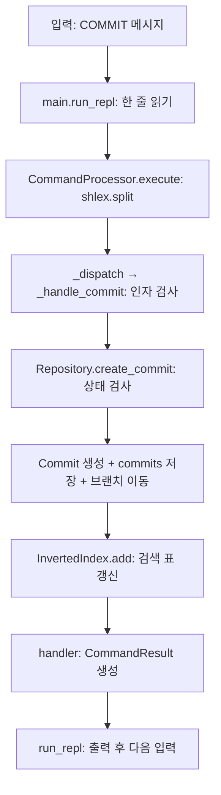
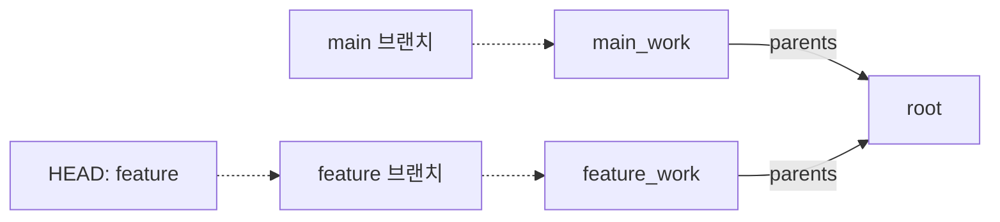

# Mini Git 실습형 학습 노트

이 문서는 현재 프로젝트 코드를 직접 실행하며 이해하기 위한 학습 순서와 실습을 제공합니다.
Python의 변수·조건문·반복문·함수를 조금 알고 있다는 전제로 작성했습니다.
문법이 낯설면 [상세 코드 분석 가이드](CODE_ANALYSIS_GUIDE.md)의 3장을 먼저 읽으세요.
과제의 평가 기준은 [과제 원문](subject.md), 사용법은 [README](../README.md)에 있습니다.

## 1. 무엇부터 공부할까?

한 번에 모든 파일을 이해하려고 하지 말고, 아래 단계를 한 번에 하나씩 진행하세요.
시간은 권장치이며 이해가 어려운 단계는 여러 번 나눠도 됩니다.

| 단계 | 권장 시간 | 읽을 코드 | 학습 후 할 수 있어야 하는 설명 |
| --- | --- | --- | --- |
| 1. 실행과 데이터 | 30분 | [models.py](../minigit/models.py), [main.py](../main.py) | 커밋 한 개의 필드와 REPL의 역할 |
| 2. 저장소 상태 | 45분 | [repository.py](../minigit/repository.py)의 초기화·브랜치·커밋 | 브랜치 생성과 전환의 차이 |
| 3. 입력과 출력 | 30분 | [parser.py](../minigit/parser.py) | 명령 문자열이 함수 호출이 되는 과정 |
| 4. 검색과 정렬 | 60분 | [index.py](../minigit/algorithms/index.py), [sort.py](../minigit/algorithms/sort.py) | 역색인, 교집합, 안정 정렬 |
| 5. 그래프 | 60~90분 | [graph.py](../minigit/algorithms/graph.py) | 위상 정렬·BFS·조상 탐색의 차이 |
| 6. 검증 | 45분 | [tests](../tests) | 정상·경계·오류 테스트의 목적 |

각 단계는 **예상하기 → 실행하기 → 다른 이유 찾기 → 말로 설명하기** 순서로 공부합니다.
코드를 그대로 옮겨 쓰기보다, 실행 전에 반환값이나 상태를 적는 것이 중요합니다.

## 2. 실행 준비

프로젝트 최상위 폴더에서 실행합니다. 외부 패키지 설치는 필요 없습니다.

```bash
python --version
python main.py
```

Python 3.10 이상이어야 합니다. 현재 검토 환경에서는 `python`이 3.11.4이고
`python3`는 3.9이므로 명령 이름만 보고 버전을 판단하지 마세요.
종료하려면 Mini Git 프롬프트에 `quit`을 입력합니다. 종료하면 기록은 사라집니다.

아래 Python 실습은 별도로 터미널에서 `python`을 실행한 뒤 붙여 넣으세요.
`mini-git>`에는 Mini Git 명령을, Python의 `>>>`에는 Python 코드를 입력합니다.

## 3. 꼭 알아야 할 Python 문법

| 문법 | 코드에서 뜻하는 것 | 확인할 위치 |
| --- | --- | --- |
| `self` | 현재 저장소나 처리기 객체 | `Repository.__init__` |
| `@dataclass` | 필드에 맞는 생성자·동등 비교 등을 생성 | `Commit` |
| `frozen=True` | 필드 재할당을 막음 | `Commit` |
| `slots=True` | 인스턴스 필드를 제한하고 메모리 사용을 줄임 | `Commit` |
| `tuple[str, ...]` | 문자열을 0개 이상 담는 불변 순서 자료형 | `parents` |
| `str \| None` | 문자열 또는 값 없음 | `head_hash` |
| `@property` | 호출 괄호 없이 읽는 계산된 속성 | `head_hash` |
| `@staticmethod` | 객체 상태 없이 동작하는 클래스 내부 함수 | `tokenize`, `_format_log_commit` |
| `lambda`와 `key` | 정렬 알고리즘에 비교 기준을 전달 | `get_log` |
| `setdefault(k, [])` | 키가 없으면 빈 목록을 등록하고 그 값을 반환 | `branches_by_commit` |
| `set(a)` | 중복 제거 또는 기존 집합의 복사 | `search_keywords` |
| `raise`와 `except` | 오류를 발생시키고 적절한 계층에서 처리 | `RepositoryError`, `execute` |
| `assert` | 개발자가 기대하는 내부 조건 검사 | `create_commit` |

타입 힌트는 런타임 입력 검증을 대신하지 않습니다. 예를 들어 `parents`에 tuple을
쓰도록 선언해도 Python이 잘못 전달한 list를 자동 변환하지는 않습니다.
`assert`도 최적화 실행에서는 생략될 수 있으므로 사용자 입력 검증은 `if`와 예외로 합니다.

## 4. 전체 실행 흐름



`Repository`는 출력 문자열을 만드는 일을 대부분 parser에 맡깁니다.
알고리즘 함수는 사용자 프롬프트를 몰라도 실행할 수 있습니다.
이 분리 덕분에 터미널 입력 없이 저장소와 알고리즘을 테스트할 수 있습니다.

## 5. 실습: 브랜치는 무엇을 저장할까?

Python에서 실행하세요. 해시는 실행마다 달라지므로 변수로 보관합니다.

```python
from minigit.repository import Repository

repo = Repository()
repo.initialize("Alice")
root = repo.create_commit("Initial commit")
repo.create_branch("feature")
main_work = repo.create_commit("Add payment")
repo.switch_branch("feature")
feature_work = repo.create_commit("Add login")

print(repo.head_branch)
print(repo.branches["main"] == main_work.hash)
print(repo.branches["feature"] == feature_work.hash)
print(main_work.parents == feature_work.parents == (root.hash,))
print(repo.get_path(main_work.hash, feature_work.hash))
```

예상 결과는 `feature`, `True`, `True`, `True`, 그리고
`[main_work.hash, root.hash, feature_work.hash]`에 해당하는 실제 해시 목록입니다.



이 그림의 실선은 **자식에서 부모**로 향합니다. 브랜치의 점선은 부모 간선이 아닙니다.
`PATH`를 계산할 때만 부모 간선을 양방향으로 사용합니다.

확인 질문: `create_branch()`가 커밋을 복사하지 않는다는 것을 어느 줄에서 알 수 있나요?

**해설:** `self.branches[branch_name] = current_hash`는 해시를 저장할 뿐입니다.
`switch_branch()`는 `head_branch`만 바꿉니다. 커밋 수는 두 작업 모두에서 늘지 않습니다.

## 6. 실습: 검색은 왜 전체 메시지를 읽지 않을까?

```python
from minigit.parser import CommandProcessor

processor = CommandProcessor()
commands = [
    'init "Alice Kim"',
    'commit "Add login feature"',
    'commit "Add payment feature"',
    'commit "Fix --author=Bob parsing"',
    'search "LOGIN feature"',
    'search --author="alice kim"',
    'search -- "--author=Bob"',
    'search --author=Bob',
]
for command in commands:
    print(command)
    print(processor.execute(command).output)
```

마지막 네 검색의 결과 개수는 각각 **1, 3, 1, 0**입니다.

- 키워드는 `lower().split()`으로 정규화합니다. `login!`은 `login`과 다릅니다.
- 여러 단어는 AND 검색입니다. 단어의 순서나 연속된 문구 일치는 검사하지 않습니다.
- 작성자는 대소문자를 무시하고 전체 이름이 일치해야 합니다.
- `--`는 이후의 인자 하나를 메시지 검색어로 처리하게 합니다.
- `shlex.split()`은 따옴표를 제거합니다. 따라서 따옴표만으로 옵션과 검색어를 구분할 수 없습니다.

현재 `search_keywords()`를 다음 순서로 읽어 보세요.

1. 검색어를 토큰으로 나누고 중복 토큰을 제거합니다.
2. 각 토큰의 후보 집합을 찾습니다. 없는 단어가 있으면 즉시 빈 결과입니다.
3. `min(candidates, key=len)`으로 가장 작은 집합을 선택합니다. 이것은 정렬이 아닌 최소값 탐색입니다.
4. 그 집합을 복사하고 다른 후보들과 교집합을 계산합니다.
5. 저장소가 결과 커밋만 가져와 날짜와 해시 기준으로 정렬합니다.

확인 질문: `matches = smallest`로 바꾸면 왜 위험할까요?

**해설:** 두 변수가 동일한 인덱스 집합을 가리킵니다. `intersection_update()`가 원본 색인을
줄여 다음 검색에서 커밋이 사라질 수 있습니다. `set(smallest)`로 복사하는 이유입니다.

## 7. 실습: 안정 정렬과 동률 규칙

```python
from minigit.algorithms.sort import merge_sort

records = [("first", 2), ("second", 1), ("third", 2)]
print(merge_sort(records, key=lambda row: row[1]))
print(records)
```

결과는 `[('second', 1), ('first', 2), ('third', 2)]`이며 원본은 그대로입니다.
같은 키 2를 가진 `first`, `third`의 순서가 유지되는 것이 안정성입니다.

`_merge()`의 `if not right_key < left_key`를 찾아보세요. 두 키가 같으면 왼쪽을
먼저 꺼내므로 앞서 있던 항목이 먼저 나옵니다.

주의할 점은 LOG가 사용하는 **키 전체**입니다.

| 명령 | 비교 순서 |
| --- | --- |
| `LOG` | 부모 우선, 준비된 후보 중 `(timestamp, hash)` |
| `LOG --sort-by=date` | `(timestamp, hash)` |
| `LOG --sort-by=author` | `(author.lower(), timestamp, hash)` |

따라서 날짜가 같아도 해시가 다르면 동일한 키가 아닙니다.
날짜·작성자 정렬은 기본 LOG의 부모 우선 순서를 보장하는 기능도 아닙니다.
Quick Sort는 학습용이며 CLI에서는 호출하지 않습니다. 작은 파티션만 재귀 호출해
스택 깊이를 제한해도 최악 시간복잡도 O(N²)가 사라지는 것은 아닙니다.

## 8. 실습: 세 가지 그래프 알고리즘 구분하기

아래는 다중 부모를 포함한 테스트용 DAG입니다. 현재 CLI에는 MERGE 명령이 없으므로
알고리즘 함수에 직접 데이터를 전달합니다. 실습을 위해 모든 시각을 같게 둡니다.

```python
from minigit.models import Commit
from minigit.algorithms.graph import topological_sort, find_shortest_path, find_ancestors

stamp = "2024-01-01 09:00:00"
commits = {
    "111111": Commit("111111", "root", "Alice", stamp, ()),
    "aaaaaa": Commit("aaaaaa", "left", "Alice", stamp, ("111111",)),
    "dddddd": Commit("dddddd", "right", "Alice", stamp, ("111111",)),
    "eeeeee": Commit("eeeeee", "merge", "Alice", stamp, ("aaaaaa", "dddddd")),
}
print([commit.hash for commit in topological_sort(commits)])
print(find_shortest_path(commits, "111111", "eeeeee"))
print(find_ancestors(commits, "eeeeee"))
```

예상 결과:

```text
['111111', 'aaaaaa', 'dddddd', 'eeeeee']
['111111', 'aaaaaa', 'eeeeee']
{'111111', 'aaaaaa', 'dddddd'}  # set의 표시 순서는 달라질 수 있음
```

| 알고리즘 | 이동·처리 규칙 | 핵심 자료형 | 왜 사용하는가? |
| --- | --- | --- | --- |
| Kahn 위상 정렬 | 모든 부모가 처리된 노드만 출력 | 진입 차수 dict + 최소 힙 list | 부모 우선 LOG |
| BFS | 시작점에서 가까운 거리부터 방문 | `deque` 큐 + 거리 dict | 간선 수가 최소인 PATH |
| 조상 탐색 | 부모 방향으로만 방문 | 스택 list + 방문 set | 모든 조상 찾기 |

Kahn의 처리 과정을 손으로 적어 보세요.

| 꺼낸 노드 | 처리 후 바뀐 진입 차수 | 다음에 준비된 노드 |
| --- | --- | --- |
| 시작 전 | root=0, left=1, right=1, merge=2 | root |
| root | left=0, right=0 | left, right |
| left | merge=1 | right |
| right | merge=0 | merge |
| merge | 변화 없음 | 없음 |

힙 배열 전체가 정렬된 것은 아닙니다. 부모 인덱스의 키가 자식보다 크지 않게 유지하여
최솟값만 빠르게 꺼냅니다. 자식 인덱스는 `2*i+1`, `2*i+2`, 부모는 `(i-1)//2`입니다.

PATH에서는 두 BFS로 얻은 거리를 사용합니다. 다음 후보는 시작 거리에서 한 칸
전진하면서, 시작 거리와 끝 거리의 합이 최단 거리와 같아야 합니다.
이 조건을 만족하는 이웃 중 가장 작은 해시를 고릅니다. 아무 이웃 중 최솟값을 고르면
최단 경로를 벗어날 수 있습니다. 동일한 6자리 해시에서는 처음 다른 해시의 비교로
경로 문자열의 사전순을 결정할 수 있습니다.

## 9. 복잡도는 어디까지 센 것인가?

V는 전체 커밋 수, E는 부모 연결 수, B는 브랜치 수, R은 검색 결과 수입니다.
해시 길이와 비교 키 길이를 상수로 보는 일반적인 분석입니다.

| 작업 | 시간 비용 | 주의점 |
| --- | --- | --- |
| 해시로 커밋 조회 | 평균 O(1) | 문자열 처리·최악 해시 충돌 비용과 구분 |
| Kahn + 직접 구현 힙 | O(E + V log V) | 간선 갱신과 노드별 힙 연산을 분리해서 계산 |
| PATH | O(V + E) | 인접 그래프를 요청마다 만들고 두 번 BFS |
| 조상만 탐색 | O(Va + Ea) | Va, Ea는 방문한 조상과 관련 간선 규모 |
| ANCESTORS의 정렬까지 | O(Ea + Va log Va) | 탐색 후 위상 정렬을 추가 수행 |
| 검색 | 토큰 처리 + 후보 집합 처리 + O(R log R) | dict 조회만 평균 O(1) |
| 로그 브랜치 목록 구성 | O(B) 순회 + 이름 정렬 | 정렬까지 보수적으로 O(B log B), 커밋마다 B개를 재조회하지 않음 |
| Merge Sort | O(N log N) | 추가 메모리 O(N), 원본 보존 |

출력 문자열을 만드는 비용은 출력 길이에 비례하여 별도로 듭니다.
`get_log()`의 정렬만 분석한 값과 CLI 전체 실행 비용은 같지 않을 수 있습니다.

## 10. 테스트로 이해 확인하기

```bash
python -m unittest discover -s tests -v
python -m unittest tests.test_cli.CommandProcessorTests.test_search_option_terminator_searches_literal_keywords -v
python -m unittest tests.test_repository.RepositoryTests.test_hash_collision_retries_without_overwriting_existing_commit -v
```

문서 작성 시점의 전체 테스트는 40개입니다. 통과 횟수보다 무엇을 검증하는지 읽어보세요.

- 검색 테스트: 옵션 종료 문법, 잘못된 인자, 기존 작성자 검색을 함께 확인합니다.
- 브랜치 표시 테스트: 커밋 이후 이름표가 새 HEAD로 이동하는지 세 종류 LOG에서 확인합니다.
- 역색인 테스트: 검색 순서·중복 단어가 결과에 영향을 주지 않고 원본 색인이 보존되는지 확인합니다.
- 충돌 테스트: `patch()`로 SHA-1 반환값을 강제합니다. 앞 6자리가 겹치는 결과를 두 번 주고
  세 번째에 다른 해시를 반환해 재시도·기존 커밋 보존·인덱스 갱신을 확인합니다.

`patch("minigit.repository.hashlib.sha1")`는 테스트 범위에서만 함수를 대신합니다.
`side_effect` 목록의 원소가 호출할 때마다 하나씩 반환되며 블록을 나가면 원래 함수로 돌아갑니다.

테스트를 읽을 때 준비(Arrange), 실행(Act), 검증(Assert)을 구분하고,
“이 구현의 어떤 줄을 잘못 바꾸면 이 테스트가 실패할까?”를 생각해 보세요.

## 11. 자주 생기는 오해

- `INIT`은 최초 커밋을 만들지 않습니다. 최초 커밋 전 BRANCH는 거부됩니다.
- 커밋을 만든 뒤 기존 커밋의 부모를 수정하지 않으므로 정상 저장소 API 사용에서는 DAG가 유지됩니다.
  공개 dict를 외부에서 직접 바꾸는 경우까지 보호하는 설계는 아닙니다.
- 해시는 암호화된 메시지가 아닙니다. 이 프로젝트에서는 식별자이며 충돌 검사를 따로 합니다.
- 기본 LOG는 현재 브랜치만이 아닌 저장소 전체 커밋을 반환합니다.
- 검색 역색인은 실제 Git의 스테이징 영역인 index와 다른 개념입니다.
- 파일 내용·영속 저장·원격 통신·MERGE·DIFF는 현재 구현 범위에 없습니다.
- 작성자를 바꾸는 CLI도 없습니다. 여러 작성자 정렬 테스트는 직접 준비한 커밋으로 검증합니다.

## 12. 스스로 풀어볼 문제

먼저 답을 가리고 예상한 뒤 관련 함수와 테스트에서 확인하세요.

| 문제 | 확인할 곳 |
| --- | --- |
| 동일한 메시지를 연속 커밋해도 해시가 다른 이유는? | `_make_unique_hash` |
| SEARCH 결과 set을 그대로 수정해도 색인이 유지되는 이유는? | `search_keywords`, `search_author` |
| 최초 커밋에 ANCESTORS를 요청하면 무엇이 나오는가? | `_handle_ancestors` |
| 순환이 있는 그래프에서 Kahn은 무엇을 확인하는가? | `topological_sort` 마지막 조건 |
| `SEARCH --`만 입력하면 어떻게 되는가? | `_handle_search` |
| 로그 브랜치 매핑을 영구 캐시로 만들면 어떤 명령에서 갱신해야 할까? | `initialize`, `create_branch`, `create_commit` |

**해설:** nonce가 증가하고 부모도 달라질 수 있습니다. 검색은 복사된 집합을 반환합니다.
최초 커밋은 `No ancestors`입니다. Kahn은 처리한 노드 수가 전체보다 작으면 예외를 냅니다.
`SEARCH --`는 검색어가 없어 `Invalid args`입니다. 영구 매핑은 초기화·브랜치 생성·커밋 시
갱신해야 하지만 현재 구현은 LOG마다 새로 만들어 동기화 문제를 피합니다. SWITCH는 이름표 위치를 바꾸지 않습니다.

마무리 연습으로, 코드를 보지 않고 COMMIT의 실행 경로와 네 가지 상태
`commits`, `branches`, `head_branch`, `index`의 변화를 종이에 그려보세요.
그다음 [상세 가이드](CODE_ANALYSIS_GUIDE.md)에서 설명이 막힌 부분만 다시 읽으세요.
